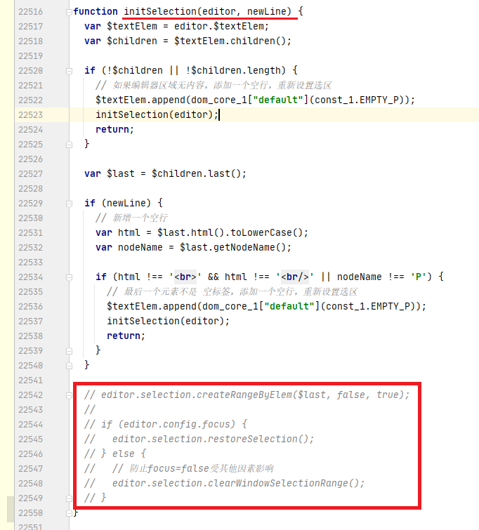

# vueproject

## 注意
由于WangEditor富文本编辑器默认使用wangeditor.txt.html(content)设置内容后会自动获取焦点，导致自动刷新面试题后会出现丢失原有焦点的问题。
这个设定无法通过设置参数解决，因此需要更改WangEditor的源代码。具体更改方式如下：  
使用npm install将所有依赖包下载后，在项目的

>/node_modules/wangeditor/dist/wangeditor.js

在initSelection(editor, newLine)函数或约22542行找到如下代码  



将红色线框住的代码去掉即可。

## Project setup
```
npm install
```

### Compiles and hot-reloads for development
```
npm run serve
```

### Compiles and minifies for production
```
npm run build
```

### Lints and fixes files
```
npm run lint
```

### Customize configuration
See [Configuration Reference](https://cli.vuejs.org/config/).